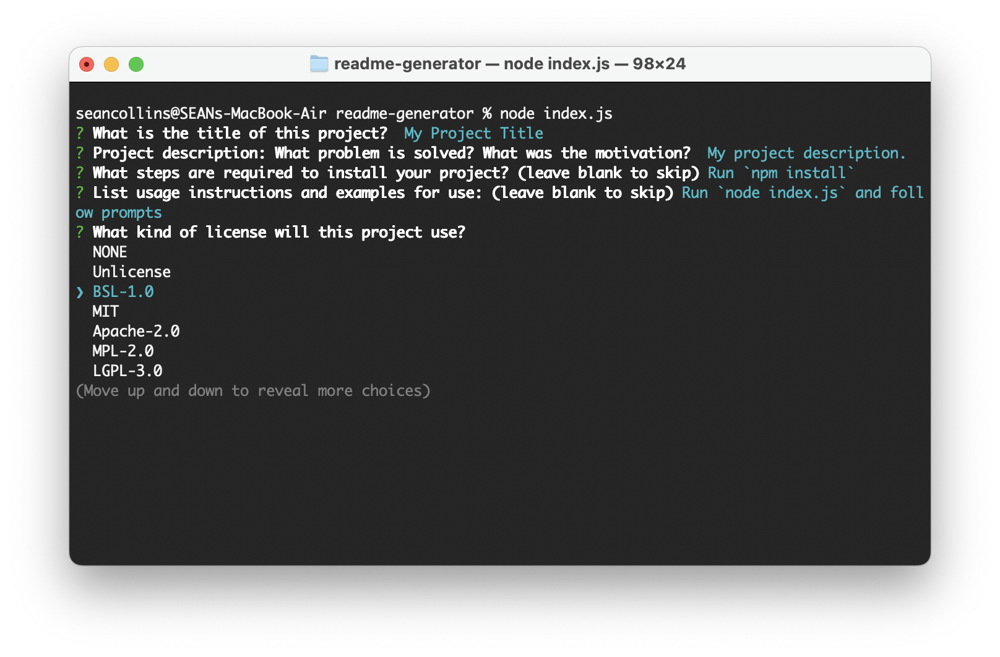
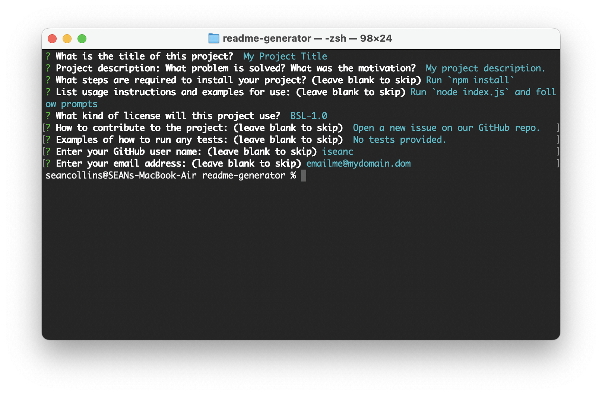
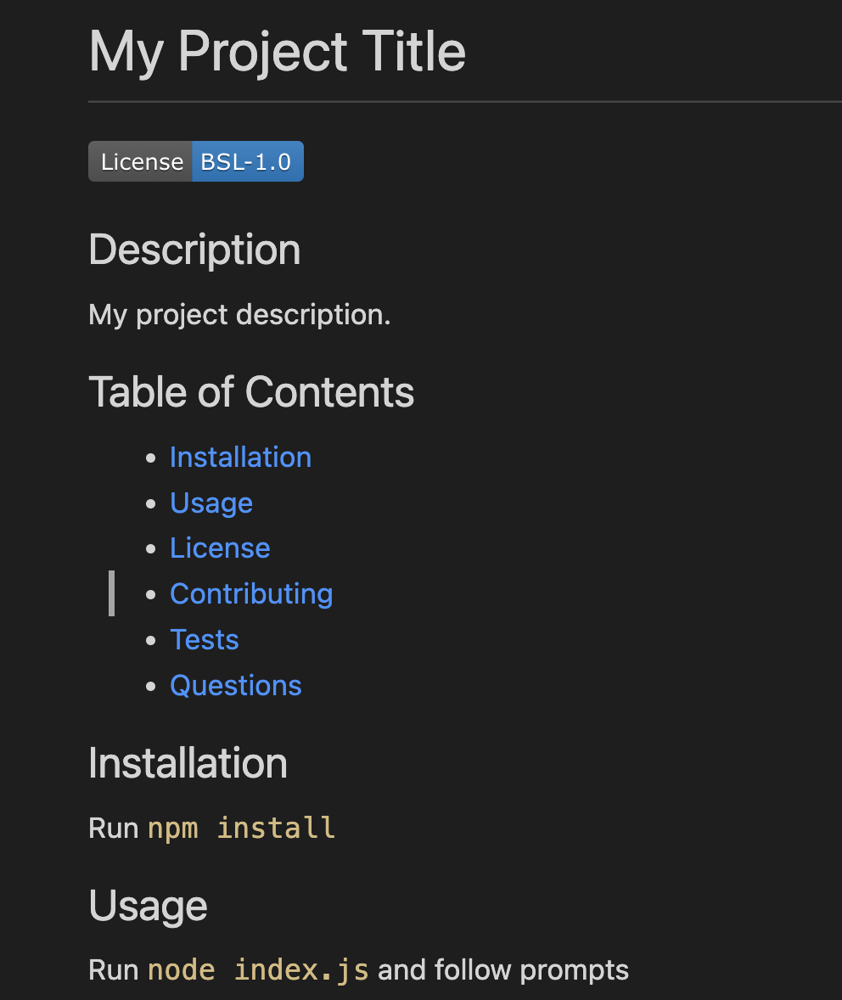
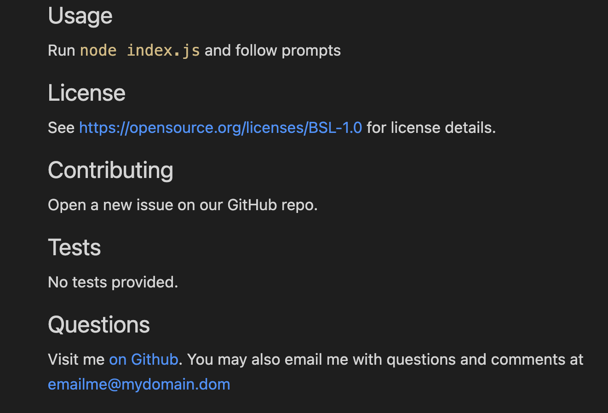

# Professional README Generator Starter Code

- NOTE: README template is based on [How to create a Professional README](https://coding-boot-camp.github.io/full-stack/github/professional-readme-guide)

## Description

As a web-developer, I want to have a tool that helps me quickly generate professional-looking README files, so that I can provide more consistency and work more efficiently.

This project is the result of an assignment from a Full Stack Web Coding Boot Camp.  Additionally, the instructor recommended this as a valuable project that can be used in the future.

## Table of Contents (Optional)

If your README is long, add a table of contents to make it easy for users to find what they need.

- [Installation](#installation)
- [Usage](#usage)
- [License](#license)
- [Features](#features)
- [How to Contribute](#contribute)
- [Tests](#test)

## Installation

What are the steps required to install your project? Provide a step-by-step description of how to get the development environment running.

- Make sure Node.JS is installed on you computer.
- Clone the [GitHub Repository](https://github.com/iseanc/readme-generator)
- Open a terminal/command-prompt and run `npm install`.

## Usage

Provide instructions and examples for use. Include screenshots as needed.

- From a terminal window, switch to the directory where you cloned the REAME Generator repository.
- To run the application, type `node index.js` and hit Enter.
- Follow the prompts to enter information for your README file.
- After completing the last prompt, a new README.md file will be created in a ./data folder under the app directory.
- NOTE: The ./data folder must exist or the application will error while attempting to write the file to disk.  If a README.md file already exists, it will be overwritten.

**Video Walkthroughs**

See my [Video Demo on Screencastify](https://watch.screencastify.com/v/TGJCmYKD0zanIdI6hcQw)

**Screen Shots**

## License

[MIT License](LICENSE/).

## Features

- If you leave any of the prompts blank (except for Title and Description), the app will skip creating those sections in the final README. and they will not be added to the Table of Contents.
- If you choose NONE for license, then the License section will not be created or added to the Contents.
- If you answer either or both of the GitHub username and email address prompts, the Questions section will be created and added to the Table of Contents.  Otherwise, this section will not be created.

## How to Contribute

Visit the [README Generator repo](https://github.com/iseanc/readme-generator) and submit a new Issue.

## Tests

Some tests you can try:
- Run the app without the ./data folder.
- Skip any of the prompts and verify that the section is not included in the README.md nor in the Table of Contents.
- Try different license options and verify that a license badge and License section with a link to the License website are added to the README.
- When you choose NONE on the License prompt, the License section, badge, and Table of Contents entry should not be added to the final README.
